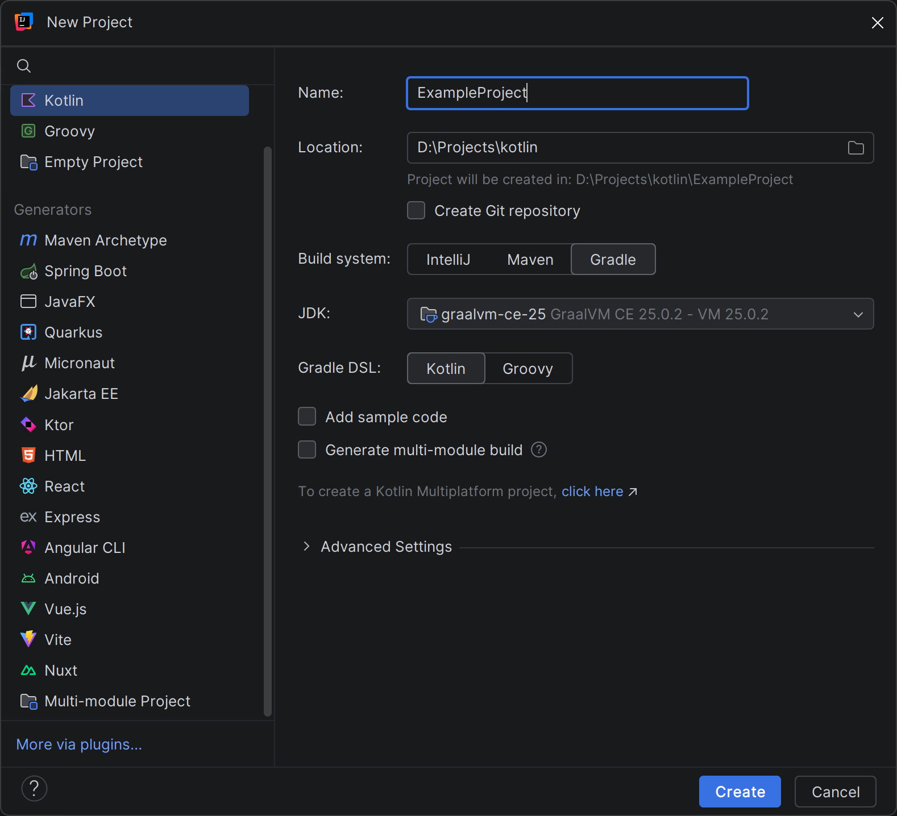

# Step-by-step example


### 1. Project creation

Create new Kotlin project in IDEA

1. Select Gradle as a build system
2. Select Kotlin as a Gradle DSL
3. Uncheck "Add sample code"



### 2. Reconfigure to Multiplatform (optional)

!!! note
    By default, IDEA creates a Kotlin/JVM project. 
    Since the plugin supports Multiplatform, further examples will use it.
    
    You can skip this step to use only Kotlin/JVM.

#### In build.gradle.kts:

1. Change `kotlin("jvm")` to `kotlin("multiplatform")`
2. Remove `dependencies {}` and `tasks.test {}` blocks
3. Clean `kotlin {}` block and add `jvm()`

Minimal Multiplatform `build.gradle.kts` will look like this:
```kotlin
plugins {
    kotlin("multiplatform") version "2.3.20"
}

group = "org.example"
version = "1.0"

repositories {
    mavenCentral()
}

kotlin {
    jvm()
}
```

#### In Project:

Clean content in `src` and create `commonMain/kotlin/` directory


## 3. Declare natives

Add `native-kt` plugin:
```kotlin
plugins {
    // ...
    id("com.huskerdev.native-kt") version "2.0.2"
}
```

Declare new native project `myNatives` and disable `useForeignApi` (for JDK < 23):
```kotlin
kotlin {
    // ...
}

natives {
    useForeignApi = false
    
    create("myNatives")
}
```

Synchronize Gradle and call task:
```sh
:cmakeInitMyNatives
```

## 4. Call function

Create Kotlin file and write main function:

```kotlin

import natives.myNatives.*

suspend fun main() {
    // Load library
    loadMyNatives()
    
    // Call
    helloWorld()
}
```

## 5. Further development.

You can now edit the `natives/myNatives/api.ndl` file, sync Gradle to generate code, 
and use it.