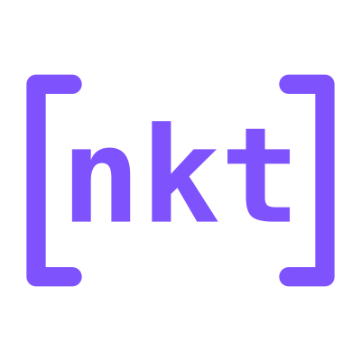

---
hide:
  - navigation
  - toc
---
# Home {style="display:none"}

[//]: # (Logo)

[//]: # (Title text)

native-kt

[//]: # (Sub title text)

Convenient C/C++ integration with Kotlin Multiplatform

[//]: # (Buttons)

[Learn more](overview){ .md-button .md-button--primary }
[:simple-github: &nbsp; Sources](https://github.com/husker-dev/native-kt){ .md-button }

[//]: # (Cards)

-  :simple-kotlin: &nbsp;  **All Platforms** 

    ---

    JVM, Native, JS, Wasm and Android

-   :simple-cmake: &nbsp; **CMake**

    ---

    Build C/C++ with well-known tool

-   :simple-intellijidea: &nbsp; **IDEA Plugin**

    ---

    Tooling plugin with syntax highlighting and icons

